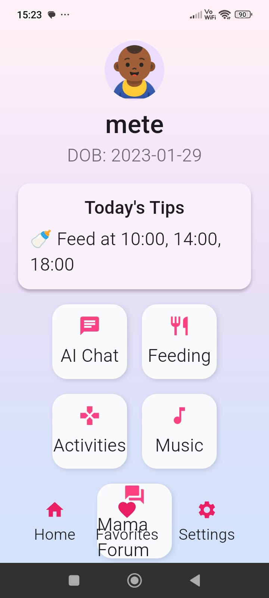
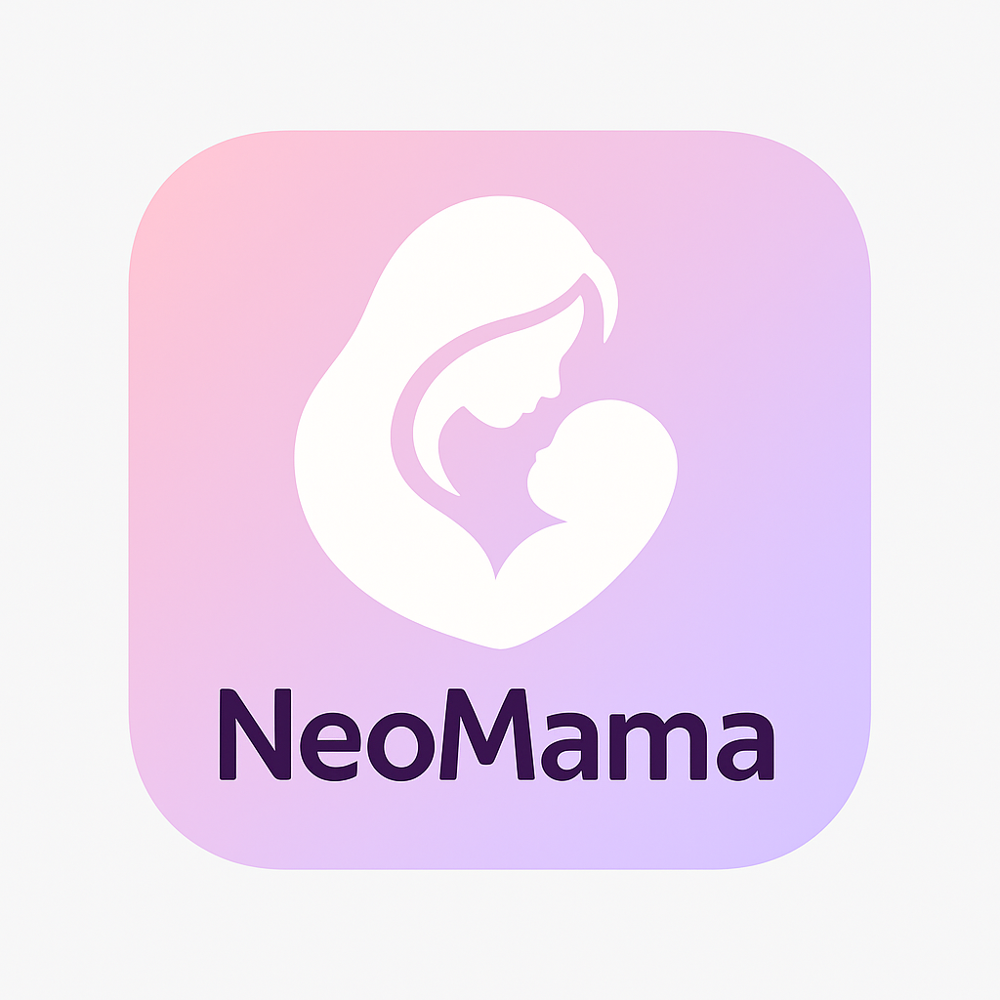

> Flutter app source is located inside `mobile_app/` directory
This project was submitted as part of Harvard's CS50 course.
It is fully built by Dila Dicle Kekeç, a self-taught developer and mother of one 💜
# NeoMama

## 👩‍💻 Author
  
**Dila Dicle Kekeç**  
A geography teacher turned developer — building tools for real life.

- [LinkedIn](https://www.linkedin.com/in/dila-dicle-kekeç-330032279/)
- [Kaggle](https://www.kaggle.com/diladiclekeke)
- [GitHub](https://github.com/dilakekec)

NeoMama is a mobile companion app built with ❤️ for new mothers.  
It helps support daily baby care with:

- 🤖 AI-powered chat assistant  
- 🍼 Feeding & sleep reminders  
- 🎵 Offline lullabies  
- 🎯 Monthly development insights  
- 🎮 Play ideas & activities  
- 📝 Articles and saved content  
- 🛏️ Sleep scheduling  
- 💬 Mom forum

## 📱 Screenshots

### 🌸 Dashboard  


### 🧠 Side Menu  


### 📲 App Icon  


---
## ⚙️ Tech Stack

- **Frontend:** Flutter (Dart)  
- **Backend:** FastAPI (Python)  
- **Storage:** Firebase (Firestore, Auth)  
- **Local Data:** SharedPreferences  
- **AI Integration:** Google Gemini API via REST

---

## 📦 Installation

```bash
git clone https://github.com/dilakekec/NeoMama.git
cd NeoMama
flutter pub get
flutter run

Demo Video

Watch the project demo here: NeoMama – CS50 Final Project (https://youtube.com/shorts/B1DkFLW11uc?feature=share)

> This is the main README for the **NeoMama** project.  
> All code lives inside the `/mobile_app` folder. 